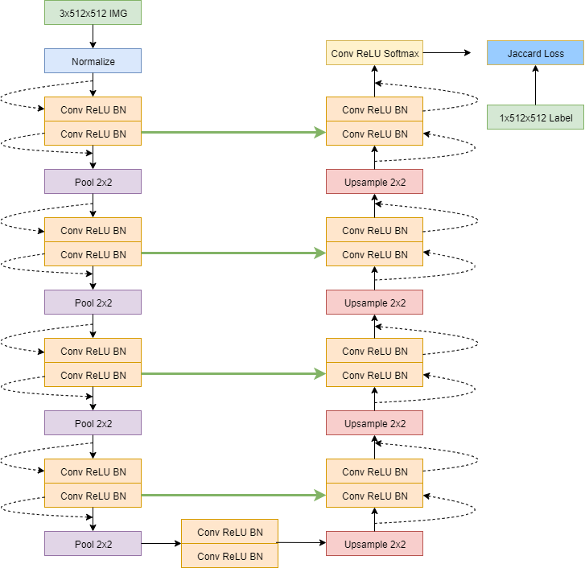

# Image Segmentation Experiementation on PASCAL-VOC-2012
Using a FCN/Unet style network to segment images.  [PASCAL VOC 2012](http://host.robots.ox.ac.uk/pascal/VOC/voc2012/) segementation dataset used as training data.
____
### The Purpose: Larger Networks and Cloud GPUs
The initial purpose of this was to exercise making larger more complex networks than plain old CNNs I have made in the past. As a bonus it turns out my GPU did not have the RAM to handle such a network and the training that comes with it... meaning I had to step into the world of cloud GPUs.
___
### The Scripts
The code was initially intended to run locally, meaning i/o was sloppy and runtime was a matter of patients. When I realized I would have to use a cloud GPU, I made the code more modular in a way that made more sense and saved more time. The order this is intended to run looks like this.

1. Download the dataset to working directory
 ```
 wget http://host.robots.ox.ac.uk/pascal/VOC/voc2012/VOCtrainval_11-May-2012.tar
 ```
 2. Extract the dataset
 ```
 python3 DataExtract.py
 ````
 3. Separate Data that is labeled from segmentation and separate training and validation data
 ```
 python3 DataSeparate.py
 ```
 4. DatasetCreate.py and SegmentNet.py are just classes that are called in actuall training script
 5. Train the model
 ```
 python3 TrainSegmentNet.py
 ```
 ___
 ### Network Architecture
 The architecture I chose for this task is a Fully-Convolutional Network with UNet skip connections and residual layers. This architecture was mainly choosen to be adventurous and explore the pytorch library but if it performs have decently that would be great as well. In the spirit of being adventurous, we also use [Jaccard Loss](https://github.com/kevinzakka/pytorch-goodies/blob/master/losses.py).
 
 
 
 ___
 ### Cloud GPUs
 I chose to use Linode. We create a CPU server to get data ready and a GPU server to actually train on. The plan goes like so:
 1. Create CPU linode (Ubuntu 18.04) and create a Volume mounted to the linode
 2. Download the dataset and git clone scripts to volume
 3. Create a StackScript to install dependencies and packages (python3.7, CUDA, numpy, etc..) on GPU linode
 4. Create a GPU (RTX 6000 32GB) linode (Ubuntu 18.04) with StackScript
 6. Shutdown both linodes
 7. Detach Volume from CPU linode
 8. Attach Volume to GPU linode
 9. Start Training and save model when done
 10. detach Volume from GPU linode and attach to CPU linode
 11. scp trained model to local machine
 ___
 ### Training
 * resized all images to 512x512 so batch size is restricted to one for GPU memory's sake. I will highly consider resizing to 256x256 instead since I will free up GPU memory and sigficicant decrease size and increase speed of the network. 
 * track losses with W and B. (we'll see if this works)
 ___
 ### Possible Improvements
 * The first improvement I would choose to make is dynamic resizing.
 * There could possibly exist a better way to encode and decode masks that is not iterating through all pixels
 * It seems possible to make a UNet like architecture work on arbitrary image size. Its just difficult to implement in a clean way.
 * Picking a good loss function was difficult. Ultimately used sum of Tversky and Cross Entropy Loss.
 
